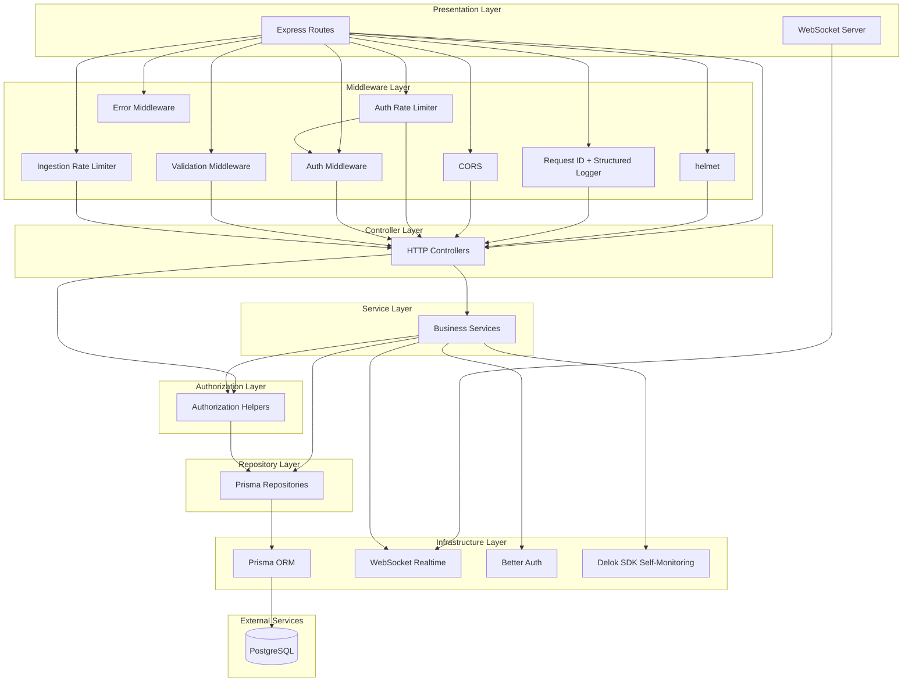

# Architecture Overview

This document describes the high-level architecture of the Delok backend, a log aggregation and monitoring platform built with Express.js and TypeScript.

## High-Level Architecture

Delok follows a **layered monolithic architecture** with clear separation of concerns. The system is organized into horizontal layers where dependencies flow downward — higher layers depend on lower layers, never the reverse.



## Layers and Responsibilities

### 1. Presentation Layer
**Purpose**: Entry points for external communication.

| Component | Responsibility |
|-----------|---------------|
| Express Routes (`app.ts`) | Define HTTP endpoints, mount middleware, wire request handlers |
| WebSocket Server (`infrastructure/realtime/websocket.ts`) | Accept WS connections, manage client subscriptions |

### 2. Middleware Layer
**Purpose**: Cross-cutting concerns applied before/after request processing.

| Middleware | Responsibility | Location |
|-----------|---------------|----------|
| helmet | Security headers | `app.ts:27` |
| Request ID + Structured Logger | Attach `req.id`, log method/path/status/duration (no bodies) | `app.ts:30-47` |
| CORS | Origin-based CORS with credentials | `app.ts:51-57` |
| Auth Rate Limiter | Protect `/api/auth` endpoints | `app.ts:61` |
| Auth Middleware | Verify session via Better Auth, attach `req.session` | `middlewares/auth.middleware.ts` |
| Validation Middleware | Validate `req.body` against Zod schemas | `middlewares/validate.middleware.ts` |
| Ingestion Rate Limiter | Protect ingestion endpoint (120 req/min per key-or-IP) | `middlewares/rate-limit/ingestion-rate-limit.middleware.ts` |
| Error Middleware | Normalize errors, format JSON responses | `middlewares/error.middleware.ts` |

### 3. Controller Layer
**Purpose**: Translate HTTP requests into service calls, format responses.

Controllers are **thin** — they extract parameters from `req.params`, `req.body`, and `req.session`, then delegate to services. They never contain business logic.

Pattern example: `backend/src/modules/organization/organization.controller.ts`

### 4. Service Layer
**Purpose**: Encapsulate business logic, orchestrate transactions, enforce authorization.

Services are the **core** of the application. They:
- Validate business rules (e.g., "organization name must be at least 3 chars")
- Call authorization helpers (`ensureOrganizationOwner`, etc.)
- Compose multiple repository operations
- Emit realtime events and audit logs

Pattern example: `backend/src/modules/organization/organization.service.ts`

> **Note**: The `user/` module is an intentional exception — it has only a controller and route (no service/repository layer). The `ingestion/` module has no authorization helper (auth is via API key, not session).

### 5. Repository Layer
**Purpose**: Data persistence abstraction. Every database query lives here.

Repositories wrap Prisma operations with semantic names. They contain **zero business logic** — only query composition. Some repositories import pure helpers from `utils/` (e.g., `project.repository.ts` imports `generateProjectSlug`).

Pattern example: `backend/src/modules/organization/organization.repository.ts`

### 6. Infrastructure Layer
**Purpose**: Integrations with external systems and low-level technical concerns.

| Component | Purpose |
|-----------|---------|
| Prisma Client (`lib/prisma.ts`) | Database adapter (PostgreSQL via `@prisma/adapter-pg`) |
| Better Auth (`lib/auth.ts`) | Authentication, session management, OAuth |
| Realtime Service (`infrastructure/realtime/realtime.service.ts`) | WebSocket event broadcasting |
| Delok SDK (`lib/delok.ts`) | Self-monitoring (the backend uses its own product for logging) |

## Dependency Direction

The critical architectural invariant is **unidirectional dependencies downward**:

```
Routes → Middleware → Controllers → Services → Authorization → Repositories → Prisma → Database
                                                                          ↓
                                                                Infrastructure (Auth, WS, SDK)
```

**Key rules** (see [dependency-rules.md](dependency-rules.md) for full detail):
- Controllers never import Prisma directly
- Services never access `req`/`res` (no Express types)
- Repositories contain only persistence logic (may import pure `utils/` helpers)
- Only `lib/` and `infrastructure/` modules may import external SDKs

## Module Organization

Business domains are organized into **modules** under `src/modules/`. Most modules contain route, controller, service, repository, validation, and authorization files. Exceptions:

- `ingestion/` — no authorization file (auth is API-key based)
- `user/` — controller + route only (no service/repository layer)

This promotes:

- **High cohesion**: All code for "organization" lives together
- **Low coupling**: Modules interact only through service-level abstractions (typically via authorization helpers from sibling modules)
- **Discoverability**: Finding all code for a feature requires navigating one directory

See [folder-structure.md](folder-structure.md) for the detailed directory map.