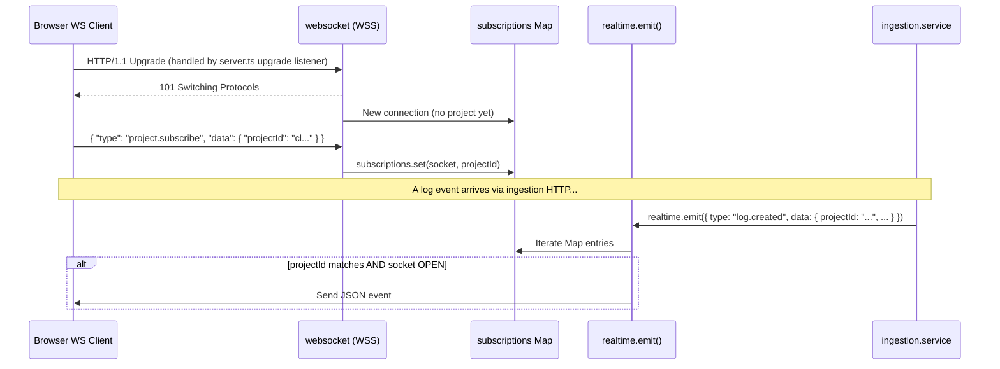

# Request Flow

This document traces the lifecycle of an HTTP request through the Delok backend, explaining where each concern (validation, auth, authz, error handling) is executed.

## Standard HTTP Request Lifecycle

```mermaid
sequenceDiagram
    participant Client
    participant WS as WebSocket?
    participant HTTP as Node HTTP Server
    participant CORS as CORS
    participant JSON as express.json()
    participant Log as Request Logger
    participant Rl as Rate Limiter
    participant R as Express Router
    participant AM as Auth Middleware
    participant VM as Validate Middleware
    participant C as Controller
    participant S as Service
    participant A as Authorization Helper
    participant Repo as Repository
    participant P as Prisma
    participant DB as PostgreSQL
    participant RT as Realtime Service
    participant WS2 as WebSocket Clients
    participant EM as Error Middleware
    participant SDK as Delok SDK

    Client->>HTTP: HTTP Request (with upgrade header for WS)
    alt WebSocket Upgrade
        HTTP->>WS: handleUpgrade()
        WS-->>Client: WebSocket Connection
        Note over WS,WS2: Separate WebSocket flow below
    else Regular HTTP
        HTTP->>H: helmet() security headers
                H->>L: Request ID + structured logger
                L->>CORS: Origin check
                CORS->>ARL: Route matched /api/auth?
                alt Auth endpoint
                    ARL->>BAuth: toNodeHandler(auth)
                else Other endpoint
                    ARL->>JSON: express.json({limit:"1mb"})
                    JSON->>R: Route matching
        R->>AM: Route has authMiddleware?
        alt Protected route
            AM->>AM: Verify session via Better Auth
            alt Session valid
                AM->>C: Set req.session, continue
            else No session
                AM-->>EM: throw AppError("unauthorized", 401)
            end
        else Public route
            R->>VM: Skip auth (e.g. /api/ingestion)
        end
        VM->>VM: Route has validate(schema)?
        alt Body validation required
            VM->>VM: schema.safeParse(req.body)
            alt Valid
                VM->>C: req.body = parsed data
            else Invalid
                VM-->>Client: 400 { success: false, errors: issues }
            end
        else No body validation
            VM->>C: Pass through
        end
        C->>S: Extract params → call service function
        S->>A: ensureOrganizationMember / ensureOrganizationOwner / ensureProjectInOrganization
        A->>Repo: Query membership / ownership
        Repo->>P: prisma.findFirst / findUnique
        P->>DB: SELECT ...
        DB-->>P: Row(s)
        P-->>Repo: Entity or null
        Repo-->>A: Membership result
        alt Not authorized
            A-->>EM: throw AppError("Forbidden", 403)
        else Authorized
            A-->>S: Pass (return entity)
        end
        S->>Repo: create / update / delete / find query
        Repo->>P: prisma.model.operation()
        P->>DB: INSERT / UPDATE / DELETE / SELECT
        DB-->>P: Result
        P-->>Repo: Entity
        Repo-->>S: Entity
        alt Needs realtime broadcast (ingestion → log.created)
            S->>RT: realtime.emit({ type, data })
            RT->>WS2: Send to matching project subscribers
        end
        S-->>C: Return data
        C-->>Client: 2xx { success: true, data }
    end

    Note over EM,SDK: Error Path
        EM->>SDK: delok.error(event, { error, message, method, path, stack })
        EM-->>Client: status { success: false, error: { code, message }, timestamp }
```

## Two Authentication Flows

The backend has **two distinct authentication mechanisms** depending on the endpoint:

### Flow A: Session-Based (UI → Backend)

Used by all routes mounted under `/api/organization/*`, `/api/organizations/:organizationSlug/projects/*`, `/api/user/me`, `/api/projects/*/logs`, `/api/projects/*/api-keys`, `/api/api-key/*`.

**Step-by-step:**
1. Client sends HTTP request with Better Auth cookies (from browser)
2. `authMiddleware` calls `auth.api.getSession({ headers: fromNodeHeaders(req.headers) })` — see `auth.middleware.ts`
3. Better Auth resolves the session cookie → looks up `Session` table → joins `User`
4. If session exists: `req.session = { user, ...session }` → proceed
5. If no session: throw `AppError("unauthorized", 401)` → caught by error middleware

### Flow B: API Key-Based (SDK → Backend)

Used exclusively by `POST /api/ingestion`.

**Step-by-step:**
1. Client (Delok SDK) sends request with `x-api-key: <rawKey>` header
2. No `authMiddleware` — ingestion route is **public** on the middleware level
3. Controller reads `req.get("x-api-key")` — see `ingestion.controller.ts`
4. Calls `createLogEventService(apiKey, ...)`
5. Service hashes the raw key with `sha256(rawKey)` → looks up `ApiKey` by `keyHash` — see `ingestion.service.ts`
6. Checks: key exists AND `revokedAt` is null → continue
7. Updates `lastUsedAt` if more than 5 minutes elapsed
8. Uses the key's linked `projectId` to create the log

**Why two flows?** Session auth is for human users (security: cookies, CSRF protection). API key auth is for machines (the Delok SDK in users' apps). The two paths never mix; an endpoint uses exactly one.

## Where Validation Happens

| Location | Scope | Tool | Output on failure |
|----------|-------|------|-------------------|
| `validate(schema)` middleware | Request body **before** controller | Zod `safeParse` | Direct 400 response with Zod issues (does NOT go through error middleware) |
| Controller (query params) | `req.query` for GET endpoints | Zod `parse` inside controller | Throws → caught by `asyncHandler` → error middleware → 500 (Zod error) |
| Service layer | Business rules (name length ≥3, key not revoked, etc.) | Manual checks + `AppError` | `throw AppError` → error middleware → formatted JSON |

**Note:** The log-event controller calls `logEventQuerySchema.parse(req.query)` (not `safeParse`), so Zod errors on query params propagate through the error middleware path rather than returning the raw Zod issues array.

## Where Authorization Happens

Authorization is **not middleware** — it's invoked explicitly inside service functions via `ensure*()` helpers.

Example flow for `DELETE /api/organizations/:organizationSlug/projects/:projectSlug`:
1. Controller → `deleteProjectService(organizationSlug, projectSlug, userId)`
2. Service → `ensureOrganizationOwner(slug, userId)` — see `organization.authorization.ts`
3. Helper → `findOwnerMembership(slug, userId)` (repo)
4. Service → `ensureProjectInOrganization(projectSlug, member.organizationId)` — see `project.authorization.ts`
5. Helper → `findProjectBySlugAndOrganization(projectSlug, organizationId)` (repo) — 404 if the project does not belong to that organization
6. If owner + project in org: proceeds to `deleteProject(projectId)`
7. If not owner: logs with `console.warn(JSON.stringify(...))` → throws `AppError("Forbidden", 403)`

This design means authorization is **co-located with business logic**: every service call makes its own authz decision. There is no declarative `@Roles(OWNER)` annotation pattern.

## Where Error Handling Happens

Errors are caught at two levels:

1. **`asyncHandler` wrapper** — wraps every async controller. Any `throw` or rejected promise inside `controller → service → repo` chain is forwarded to Express's `next(error)`. See `async-handler.ts`.

2. **`errorMiddleware`** — mounted as the last app-level middleware. See `error.middleware.ts`:
   - If error is `AppError`: use its `statusCode`, `errorCode`, `message`
   - If generic `Error`: 500 + "Internal Server Error"
   - Logs via `delok.error()` (self-monitoring) + `console.error` for 5xx
   - Returns JSON: `{ success: false, error: { code, message }, timestamp }`

**Exception:** The validation middleware returns errors directly (not via error middleware) to preserve Zod's structured `issues` array format.

## WebSocket Message Flow

Separate from HTTP requests:


