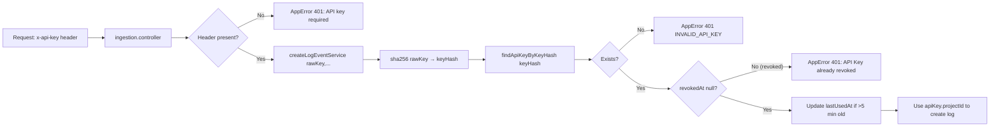

# Authentication

Delok uses **Better Auth** (`better-auth` v1.6.23) as its authentication framework. The project supports Google OAuth and GitHub OAuth only. All session storage is database-backed via Prisma.

## Better Auth Integration

Better Auth is configured in [lib/auth.ts](file:///c:/Users/Yuan/OneDrive/Desktop/Codes/Delok/delok-backend/src/lib/auth.ts) as a singleton. Key configuration (values from `lib/env.ts` validated via Zod):

| Setting | Value | Purpose |
|---------|-------|---------|
| `baseURL` | `env.BETTER_AUTH_URL` | Where the backend auth API lives (used for cookie scoping etc.) |
| `trustedOrigins` | `[env.FRONTEND_URL]` | Frontend origin allowed to receive auth cookies (dynamic, not hardcoded) |
| `database` | `prismaAdapter(prisma, { provider: "postgresql" })` | Store users/sessions/accounts in PostgreSQL |
| `onAPIError.errorURL` | `` `${env.FRONTEND_URL}/auth/error` `` | Frontend redirect target for auth errors |
| `secret` | `env.BETTER_AUTH_SECRET` | Session signing secret |

### Required Environment Variables

Validated at startup in [lib/env.ts](file:///c:/Users/Yuan/OneDrive/Desktop/Codes/Delok/delok-backend/src/lib/env.ts) (Zod `envSchema` — fail-fast throw if any missing):

```
DATABASE_URL            # PostgreSQL connection string
BETTER_AUTH_SECRET      # Session signing secret
BETTER_AUTH_URL         # Public backend URL (e.g. http://localhost:8000) — used for baseURL
FRONTEND_URL            # Frontend origin (e.g. http://localhost:3000) — used for trustedOrigins/errorURL/CORS
GOOGLE_CLIENT_ID
GOOGLE_CLIENT_SECRET
GITHUB_CLIENT_ID
GITHUB_CLIENT_SECRET
PORT                    # optional, default 8000
NODE_ENV                # development | production | test, default development
```

### Social Providers

| Provider | Config | Scopes/Permissions |
|----------|--------|-------------------|
| Google | `google.clientId`, `google.clientSecret` | Default Better Auth Google scopes (inferred, not explicitly configured in code) |
| GitHub | `github.clientId`, `github.clientSecret` | Default Better Auth GitHub scopes (inferred, not explicitly configured in code) |

## Session Handling

### Storage

Sessions are stored in the `Session` table ([auth.prisma](file:///c:/Users/Yuan/OneDrive/Desktop/Codes/Delok/delok-backend/prisma/schema/auth.prisma)):

| Field | Meaning |
|-------|---------|
| `id` | Session ID (string) |
| `token` | Hashed session token (`@@unique`) |
| `expiresAt` | Session expiry date |
| `userId` → `User` | Foreign key to user (Cascade on delete) |
| `ipAddress` | Client IP (optional) |
| `userAgent` | Client UA (optional) |

Index on `userId` for fast "get all user's sessions" queries.

### Session Resolution

The [authMiddleware](file:///c:/Users/Yuan/OneDrive/Desktop/Codes/Delok/delok-backend/src/middlewares/auth.middleware.ts) resolves sessions:

1. Extracts cookies from Node headers via `fromNodeHeaders(req.headers)`
2. Calls `auth.api.getSession({ headers })` (Better Auth's server-side session resolver)
3. If session → sets `req.session` (declared on Express via [types/express.d.ts](file:///c:/Users/Yuan/OneDrive/Desktop/Codes/Delok/delok-backend/src/types/express.d.ts) type augmentation)
4. If no session → throws `AppError("unauthorized", 401)`

`req.session` shape (Better Auth session type): `{ user: { id, name, email, image, createdAt, updatedAt }, ...sessionProps }`.

## Authentication Middleware Mounting

Not all routes are protected. The middleware is applied per-route in each module's `*.route.ts`:

| Module | Protected routes? | Notes |
|--------|-------------------|-------|
| `/api/auth/*` | Handled by Better Auth internally | Has rate limiter but no authMiddleware |
| `/api/organization/*` | ALL (5 endpoints) | authMiddleware on every route |
| `/api/organizations/:organizationSlug/projects` | ALL (5 endpoints) | authMiddleware on every route |
| `/api/projects/:projectId/logs` | ALL (1 endpoint) | authMiddleware on every route |
| `/api/projects/:projectId/api-keys` | ALL (2 endpoints) | authMiddleware on every route |
| `/api/api-key/*` | ALL (2 endpoints) | authMiddleware on every route |
| `/api/user/me` | Yes | Protected (the only user endpoint) |
| `/api/ingestion` | **NO** (not session-based) | Uses API key auth inside controller/service (see next section) |

## API Key Authentication (Ingestion Only)

The session auth middleware is NOT used for ingestion. Instead, `POST /api/ingestion` uses a custom API key flow:



Key security properties:
- **Plaintext key is never stored.** Only the SHA-256 hash (`sha256` from [utils/hash.ts](file:///c:/Users/Yuan/OneDrive/Desktop/Codes/Delok/delok-backend/src/utils/hash.ts)) is persisted in `ApiKey.keyHash`.
- **Key is returned exactly once:** from `POST /api/projects/:projectId/api-keys` 201 response. The UI is responsible for showing it to the user with a "copy this now" warning.
- **Lookup uniqueness:** `keyHash` has `@unique` in the Prisma schema, preventing hash collision DB errors.
- **Revocation check:** `revokedAt` timestamp is set when the user revokes; the ingestion flow checks this field on every request.

## Auth Route Mounting

From [app.ts](file:///c:/Users/Yuan/OneDrive/Desktop/Codes/Delok/delok-backend/src/app.ts):

```typescript
app.use("/api/auth", authRateLimiter);
app.all("/api/auth/*splat", toNodeHandler(auth));    // Catch-all: Better Auth built-in
```

The order is important:
1. Path-specific rate limits run first
2. Everything under `/api/auth/*` is handled by Better Auth's Node.js adapter

## Auth Rate Limiting

Auth endpoints are protected by [auth-rate-limit.middleware.ts](file:///c:/Users/Yuan/OneDrive/Desktop/Codes/Delok/delok-backend/src/middlewares/rate-limit/auth-rate-limit.middleware.ts) with path-specific limits:

| Path | Window | Limit |
|------|--------|-------|
| `/sign-out` | 5 min | 30 attempts |
| Other auth paths | 15 min | 20 attempts |

These use `express-rate-limit`. On breach, returns `429 RATE_LIMIT_EXCEEDED` via the `errorResponse` helper (formatted like error middleware output).
