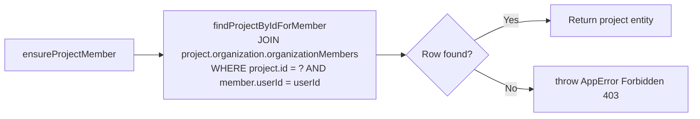
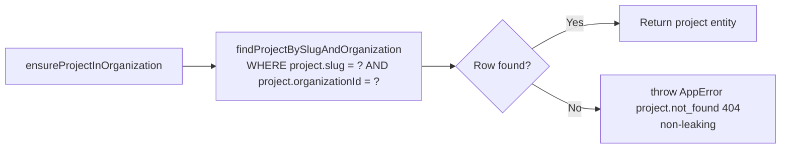
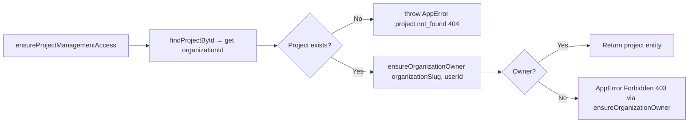

# Authorization

Authorization in Delok is a **service-layer concern**, not a middleware concern. Access-control decisions are made by calling `ensure*()` helper functions that throw `AppError("Forbidden", 403)` on failure. These helpers are always invoked from service functions before any data mutation or sensitive read.

## Role Model

The project has a **two-level role hierarchy** via the `OrganizationRole` enum (`prisma/schema/organization.prisma`):

```prisma
enum OrganizationRole {
  OWNER
  MEMBER
}
```

Roles are **per-organization**, stored in the `OrganizationMember` join table (composite PK: `[organizationId, userId]`).

| Role | Capabilities |
|------|------------------------------------------------------|
| **OWNER** | Update/delete organization; create/update/delete projects; create/list/revoke/rename API keys |
| **MEMBER** | Read organization; list projects in org; read project details; read logs for any project in the org |

There is **no per-project role** concept. Project access is derived entirely from organization membership.

## Authorization Helpers

All helpers live in `*.authorization.ts` files per module.

### Organization-Level Helpers

File: `backend/src/modules/organization/organization.authorization.ts`

#### `ensureOrganizationMember(slug, userId)`

Guarantees the user has any role (OWNER or MEMBER) in the organization.

```mermaid
flowchart LR
    A[ensureOrganizationMember] --> B[findOrganizationBySlugForMember<br/>WHERE org.slug = ? AND org.organizationMembers CONTAINS userId]
    B --> C{Row found?}
    C -- Yes --> D[Return organization entity]
    C -- No --> E[console.warn(JSON.stringify({event: "organization.access_denied", ...}))]
    E --> F[throw AppError Forbidden 403]
```

Used by:
- `getOrganizationBySlugService` (read org by slug)
- `getAllProjectsService` (list projects requires org membership)
- `getProjectBySlugService` (read a project requires membership in the URL organization)

#### `ensureOrganizationOwner(slug, userId)`

Guarantees the user has `role = OWNER` in the organization.

```mermaid
flowchart LR
    A[ensureOrganizationOwner] --> B[findOwnerMembership<br/>WHERE orgId + userId + role=OWNER]
    B --> C{Row found?}
    C -- Yes --> D[Return membership record]
    C -- No --> E[console.warn(JSON.stringify({event: "organization.owner_access_denied", ...}))]
    E --> F[throw AppError Forbidden 403]
```

Used by:
- `updateOrganizationService`, `deleteOrganizationService`
- `createProjectService` (creating a project requires org ownership)
- `updateProjectService`, `deleteProjectService`
- Indirectly by `ensureProjectManagementAccess` (see below)

### Project-Level Helpers

File: `backend/src/modules/project/project.authorization.ts`

#### `ensureProjectMember(projectId, userId)`

Guarantees the user is a member of the **parent organization** of the project. This is the base permission for reading any project data.



Used by:
- `getLogsByProjectIdService` (read logs requires project → org membership)

#### `ensureProjectInOrganization(projectSlug, organizationId)`

Guarantees the project exists **and** belongs to the given organization. The organization boundary is encoded directly in the query, so a project belonging to a different organization is never returned — even when the caller is a member/owner of that other organization too.



Used by:
- `getProjectBySlugService` (after `ensureOrganizationMember`)
- `updateProjectService`, `deleteProjectService` (after `ensureOrganizationOwner`)

#### `ensureProjectMemberBySlug(organizationSlug, projectSlug, userId)`

Primary path for GET/PATCH/DELETE project by slug. Combines org membership + project-slug lookup + ownership check in one query.

#### `ensureProjectManagementAccess(projectId, userId)`

Guarantees the user is an **OWNER** of the parent organization. Used for any destructive or management action on a project or its sub-resources (API keys).



Used by:
- `createApiKeyService` (creating API keys = management action)
- `getApiKeysByProjectIdService` (listing API keys = management action)
- `updateApiKeyNameService`, `revokeApiKeyService`

## Permission Flow Per Operation

```mermaid
graph TD
    subgraph "Organization Operations"
        ORG_READ[GET /api/organization/:slug] --> OM[ensureOrganizationMember]
        ORG_LIST[GET /api/organization] --> FILTER[Repo WHERE org has member userId<br/>(query-level filter, no helper)]
        ORG_CREATE[POST /api/organization] --> OWNER_CREATION["Auto-create OWNER membership<br/>(no pre-check: user IS the creator)"]
        ORG_UPDATE[PATCH /api/organization/:slug] --> OO[ensureOrganizationOwner]
        ORG_DELETE[DELETE /api/organization/:slug] --> OO
    end

    subgraph "Project Operations"
        PROJ_LIST[GET /organizations/:slug/projects] --> OM
        PROJ_CREATE[POST /organizations/:slug/projects] --> OO
        PROJ_READ[GET /organizations/:slug/projects/:projectSlug] --> OM
        PROJ_UPDATE[PATCH /organizations/:slug/projects/:projectSlug] --> OO
        PROJ_DELETE[DELETE /organizations/:slug/projects/:projectSlug] --> OO
        OM --> PO[ensureProjectInOrganization<br/>org membership is NOT enough]
        OO --> PO
        PO --> PROJ_RESULT[Return project or 404]
    end

    subgraph "API Key Operations"
        KEY_CREATE[POST /projects/:projectId/api-keys] --> PMA
        KEY_LIST[GET /projects/:projectId/api-keys] --> PMA
        KEY_RENAME[PATCH /api/api-key/:id] --> LOAD_KEY[findApiKeyById → projectId] --> PMA
        KEY_REVOKE[PATCH /api/api-key/:id/revoke] --> LOAD_KEY2[findApiKeyById → projectId] --> PMA
    end

    subgraph "Log Operations"
        LOG_LIST[GET /projects/:projectId/logs] --> PM
        LOG_INGEST[POST /api/ingestion] --> APIKEY["API key auth (separate path)"]
    end
```

## Cross-Module Authorization Dependencies

Authorization composes across modules. The import graph is **directional**:

```
organization.authorization.ts
    (no cross-module authz imports)
         ↑
project.authorization.ts
    imports: ensureOrganizationOwner from ../organization/organization.authorization
         ↑
api-key.service.ts, log-event.service.ts
    imports: ensureProjectMember, ensureProjectManagementAccess from ../project/project.authorization
```

This hierarchy reflects the ownership graph: **Organization owns Projects, which own API Keys and Log Events**. Authorization always walks up to the parent's owner check.

## Authorization Bypass / Public Access

One area with **no session/org authorization** (documented for completeness):

1. **Ingestion endpoint** (`POST /api/ingestion`) — doesn't use session auth or organization-level authorization. It authenticates via API key hash, and the log is written to whichever `projectId` the key belongs to. This is by design (the Delok SDK in users' applications is the caller, not a human user).

## Error Response on Failure

Every authorization helper throws:
```
AppError(message = "Forbidden", statusCode = 403)
```

Which surfaces via error middleware as one of:
```json
{ "success": false, "error": { "code": "organization.access_denied", "message": "..." } }
```
```json
{ "success": false, "error": { "code": "organization.owner_access_denied", "message": "..." } }
```
```json
{ "success": false, "error": { "code": "project.not_found", "message": "..." } }
```

Authorization helpers log via `console.warn(JSON.stringify(...))` (organization authz only — project authz throws with no log).