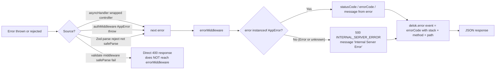

# Error Handling

Delok uses a three-part error handling system: **AppError** (custom error class), **asyncHandler** (wrapper for async controllers), and **errorMiddleware** (global error formatter + logger). This document explains how they connect.

## `AppError` — Custom Error Class

File: `backend/src/utils/AppError.ts`

```typescript
export class AppError extends Error {
  constructor(
    public message: string,
    public statusCode: number,
    public errorCode: string = "UNKNOWN_ERROR",
    public payload: object = {},
  ) {
    super(message);
    this.name = "AppError";
    Object.setPrototypeOf(this, AppError.prototype);
  }
}
```

Every domain error thrown in services/authorization constructs an `AppError` with:

- `message`: Human-readable string (sent to client if non-generic)
- `statusCode`: HTTP status code (400, 401, 403, 404, etc.)
- `errorCode`: Machine-readable code. Set in multiple places:
  - `INVALID_API_KEY` — ingestion service, invalid API key hash
  - `organization.access_denied` — org authorization, non-owner access
  - `organization.owner_access_denied` — org authorization, non-owner write
  - `project.not_found` — project authorization, project not in org
  - `PROJECT_SLUG_ALREADY_EXISTS` — project creation slug conflict
- `payload`: Optional extra data (used by `project.authorization.ts` and `project.service.ts`)

### Common AppError Usage Patterns

| Scenario | statusCode | errorCode | Location |
| ---------------------------------- | ---------- | --------------------------- | ------------------------------------------------------ |
| No session / bad credentials | 401 | `UNKNOWN_ERROR` (default) | auth.middleware, ingestion.controller (missing header) |
| Invalid API key hash | 401 | `INVALID_API_KEY` | ingestion.service |
| API key revoked | 401 | `INVALID_API_KEY` | ingestion.service |
| Forbidden (not member/owner) | 403 | `organization.access_denied` or `organization.owner_access_denied` | *.authorization.ts |
| Resource not found (targeted) | 404 | `project.not_found` | project.authorization, api-key.service |
| Validation failure (business rule) | 400 | `PROJECT_SLUG_ALREADY_EXISTS` | api-key.service (already revoked) |

## `asyncHandler` — Promise Rejection Bridge

File: `backend/src/utils/async-handler.ts`

Express's default behavior does **not** catch rejected promises from async route handlers. `asyncHandler` solves this by wrapping an async controller:

```typescript
export const asyncHandler =
  (controller: RequestHandler): RequestHandler =>
  (req, res, next) =>
    Promise.resolve(controller(req, res, next)).catch(next);
```

Without this wrapper: an `await something()` that rejects would leave the request hanging (no response sent, error logged as `UnhandledPromiseRejection`).

**Mounting pattern:** every single async controller in every route file is wrapped:

```typescript
organizationRoute.get(
  "/",
  authMiddleware,
  asyncHandler(getAllOrganizationController), // ← always wrapped
);
```

## `errorMiddleware` — Global Handler

File: `backend/src/middlewares/error.middleware.ts`

This is the **4-argument Express error handler** (it has the `error` as first parameter, which is how Express recognizes error middleware). It is mounted **last** in `app.ts` (after all routes).



### Error Normalization Table

| Error kind | statusCode | errorCode | message exposed? |
| ------------------------------------- | ---------- | ------------------------------- | --------------------------------------------------------------------- |
| `AppError("Invalid API key", 401, "INVALID_API_KEY")` | 401 | `INVALID_API_KEY` | Yes |
| Prisma `P2002` on `Organization.slug` | 409 | `ORGANIZATION_SLUG_ALREADY_EXISTS` | Yes |
| Prisma `P2002` on `Project` case-insensitive name | 409 | `PROJECT_NAME_ALREADY_EXISTS` | Yes |
| Body too large (`express.json` limit 1mb, `entity.too.large` / 413) | 413 | `PAYLOAD_TOO_LARGE` | Yes |
| Generic `new Error("oops")` or any unhandled | 500 | `INTERNAL_SERVER_ERROR` | No (returns generic message) |
| Unknown non-Error thrown (string, object, etc.) | 500 | `INTERNAL_SERVER_ERROR` | No |

### Error Response Formats

Success shape (returned from controllers):

```json
{ "success": true, "data": { ... } }
```

**Format 1** — errorMiddleware (`error: { code, message }`):

```json
{
  "success": false,
  "error": {
    "code": "INVALID_API_KEY",
    "message": "Invalid API key"
  },
  "timestamp": "2026-08-02T10:30:00.000Z"
}
```

**Format 2** — validate middleware (short-circuits before errorMiddleware):

```json
{
  "success": false,
  "errors": [{ "code": "too_small", "message": "Required", "path": ["name"] }]
}
```

**Format 3** — rate limiter (uses `errorResponse` helper):

```json
{
  "success": false,
  "errorDetail": {
    "code": "RATE_LIMIT_EXCEEDED",
    "message": "Too many sign-in requests"
  },
  "timestamp": "2026-08-02T10:30:00.000Z"
}
```

**Inconsistency note (documented, not suggested change):** the project has three JSON error response shapes in current use:

- `errorMiddleware` → `error: { code, message }`
- `validate()` middleware → `errors: ZodIssue[]`
- `errorResponse()` (rate limiter) → `errorDetail: { code, message }`

Each is used in a different layer, so clients need to check for each.

## Operational Logging

`errorMiddleware` logs 5xx errors to `console.error` as JSON AND reports them via `delok.error` event (the self-monitoring client in `lib/delok.ts`). The self-monitoring branch fires a separate `database.query_failed` event for Prisma errors:

```typescript
// middlewares/error.middleware.ts:101-110
if (error instanceof Error && statusCode >= 500) {
  console.error(JSON.stringify({ event: errorCode, message: error.message, method: req.method, path: req.path, stack: error.stack }));
  delok.error(errorCode, { error: errorCode, message: error.message, method: req.method, path: req.path, stack: error.stack });
}
```

Authorization helpers log via `console.warn(JSON.stringify(...))` (not `delok.warn`):
- `organization.authorization.ts` emits `organization.access_denied` and `organization.owner_access_denied`
- `project.authorization.ts` throws with no log

## `errorResponse` Utility

File: `backend/src/utils/api-response.ts`

Small helper used by the rate limiter. Unlike AppError + errorMiddleware, this builds and sends the response directly (the caller invokes `return errorResponse(res, ...)`).

Used for cases where the error is produced outside the asyncHandler + errorMiddleware chain: `express-rate-limit`'s `handler` callback needs to respond synchronously and cannot throw into the middleware chain.

## What Reaches the Error Middleware vs. Not

| Event | Path | Handled by |
| ------------------------------------------------------------- | ---------------------------------------------------------- | ------------------------------------------------------------------- |
| `throw new AppError(...)` in controller/service/repo/authz | asyncHandler → next(error) | errorMiddleware → AppError-aware formatting |
| Promise rejection in controller | asyncHandler catch → next(error) | errorMiddleware → 500 generic |
| `authMiddleware` throws `AppError("unauthorized", 401)` | Async middleware throw → Express catches → errorMiddleware | errorMiddleware → AppError-aware formatting |
| `Zod schema.parse()` inside controller throws | asyncHandler → next(error) | errorMiddleware → 500 generic (ZodError is not AppError) |
| `Zod schema.safeParse()` in validate middleware fails | Direct 400 with Zod issues | **Not** errorMiddleware |
| Rate limiter triggers | Direct 429 via `errorResponse(res, ...)` | **Not** errorMiddleware |
| Prisma `P2002` on `Organization.slug` | Promise reject → asyncHandler → errorMiddleware | errorMiddleware → 409 `ORGANIZATION_SLUG_ALREADY_EXISTS` |
| Prisma throws other unique constraint / foreign key violation | Promise reject → asyncHandler → errorMiddleware | errorMiddleware → 500 generic (raw Prisma error hidden from client) |

**Current blind spot**: Zod errors from `parse()` (used in log-event query validation) and Prisma constraint violations both reach the client as generic 500 "Internal Server Error" — no diagnostic info is surfaced. The operator can see the real cause in the self-monitoring logs but the calling client cannot.