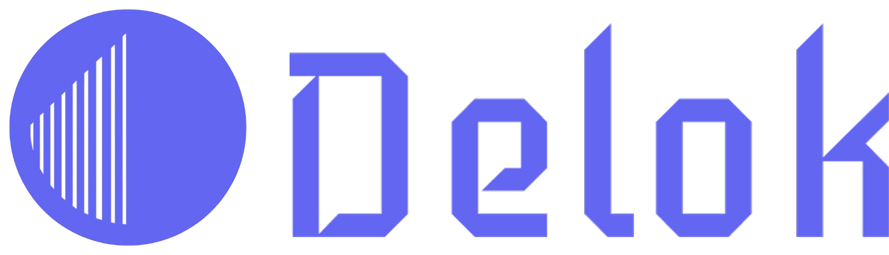
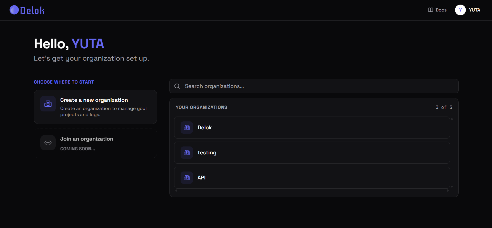
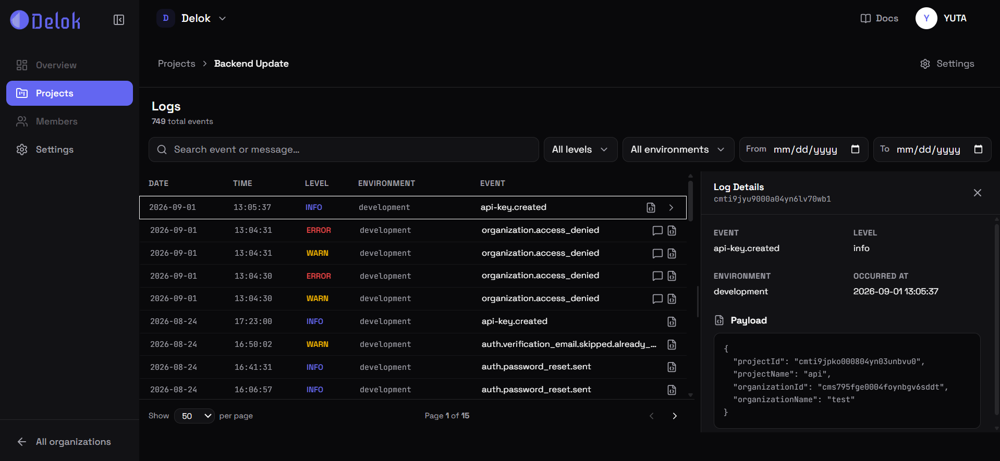
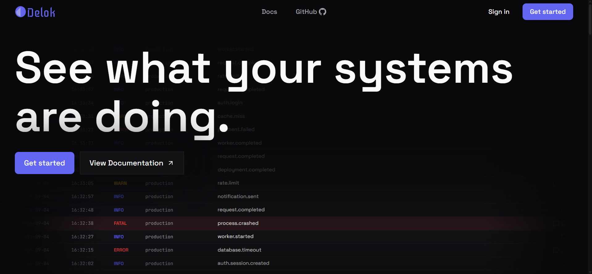
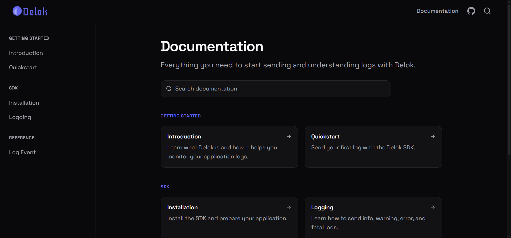

<p align="center">
  
</p>

<p align="center">
  <strong>See what your systems are doing.</strong>
</p>

<p align="center">
  Collect, search, and understand your application logs in one place.
</p>

<p align="center">
  <a href="https://delok.vercel.app">Website</a>
  ·
  <a href="https://delok.vercel.app/docs">Documentation</a>
  ·
  <a href="https://github.com/delok-dev/delok-sdk">SDK</a>
</p>

<table>
  <tr>
    <td width="50%"></td>
    <td width="50%"></td>
  </tr>
  <tr>
    <td width="50%"></td>
    <td width="50%"></td>
  </tr>
</table>

## SDK

```bash
npm install @delok/sdk
```

[Delok SDK →](https://github.com/delok-dev/delok-sdk)

## Resources

- [Website](https://delok.vercel.app)
- [Documentation](https://delok.vercel.app/docs)
- [GitHub Discussions](https://github.com/delok-dev/delok/discussions/1)

## Contributing

Contributions and feedback are welcome.

## License

[MIT](./LICENSE)
